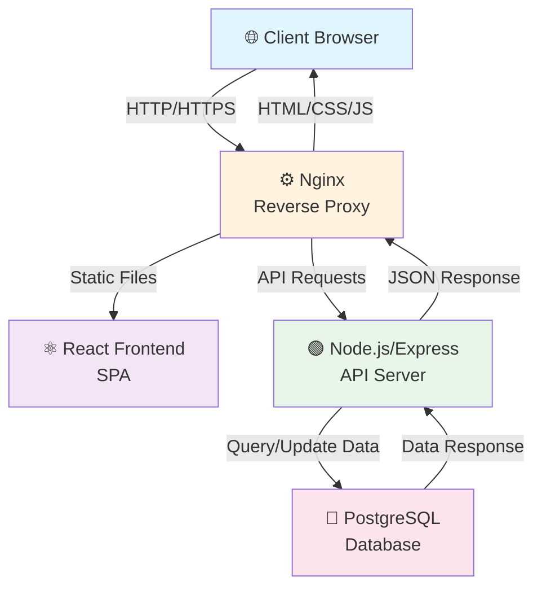

# Architecture Overview

This document provides an overview of the system architecture for the web application.

## System Architecture

The architecture follows a modern three-tier design pattern with a reverse proxy layer, consisting of:

- **Frontend**: React-based single-page application (SPA)
- **Reverse Proxy**: Nginx for request routing and load balancing
- **Backend**: Node.js/Express REST API server
- **Database**: PostgreSQL relational database

## Component Descriptions

### Client Browser
The end-user's web browser that accesses the application.

### Nginx Reverse Proxy
- Acts as the entry point for all client requests
- Routes traffic to the appropriate backend service
- Serves static assets (HTML, CSS, JavaScript)
- Provides SSL/TLS termination
- Can be configured for load balancing and caching

### React Frontend
- Single-page application built with React
- Handles all user interface and client-side interactions
- Communicates with the backend via REST API calls
- Runs entirely in the browser

### Node.js/Express Backend API
- REST API server built with Express.js
- Handles business logic and data processing
- Manages user authentication and authorization
- Processes requests and returns JSON responses
- Communicates with the PostgreSQL database

### PostgreSQL Database
- Relational database for persistent data storage
- Stores application data, user information, and related records
- Accessed exclusively through the backend API
- Ensures data integrity and consistency

## Data Flow

1. **Request Phase**: Client browser sends HTTP request to Nginx
2. **Routing Phase**: Nginx routes the request to the appropriate service (frontend assets or backend API)
3. **Processing Phase**: Backend processes the request, applies business logic, and queries the database if needed
4. **Response Phase**: Database returns data to backend, which processes and returns JSON to Nginx
5. **Delivery Phase**: Nginx returns the response to the client browser

## Key Benefits

- **Separation of Concerns**: Each layer has a distinct responsibility
- **Scalability**: Backend and frontend can be scaled independently
- **Security**: Nginx provides a security boundary and can implement rate limiting
- **Performance**: Caching and static file serving improve performance
- **Maintainability**: Clear architectural boundaries make the codebase easier to maintain
